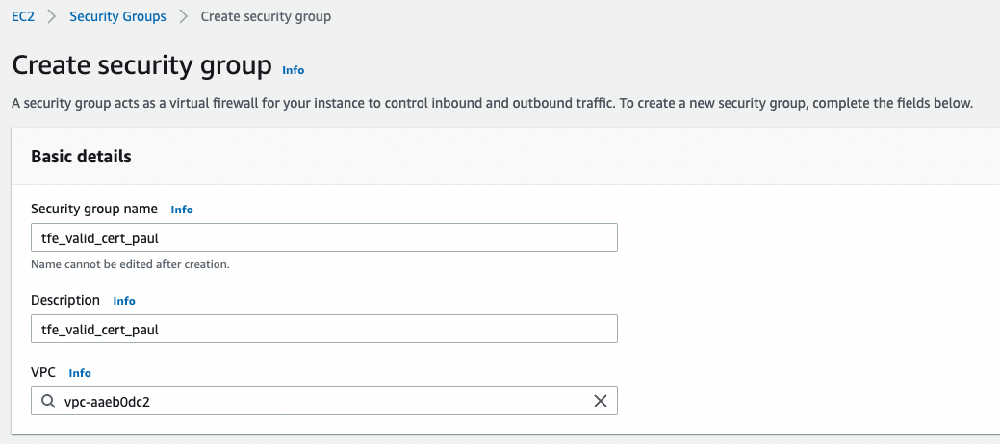
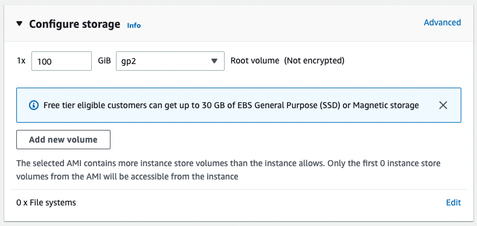

# Manual installation of TFE with a valid certificate on AWS

Here it is described how to manually install Terraform Enterpise (TFE) with a valid certificate on AWS.  

Official installation documentation can be found [here](https://www.terraform.io/enterprise/install/interactive/installer).  

# Prerequisites
 - AWS account
 - TFE license


# How to

## key pair
To be able to login with ssh to your ec2 instance, you'll need a key pair.  
Go to `Key pairs` and click `Create key pair`.  

     
Give it a useful name and click `Create key pair`.  

A pem file will be downloaded in the browser.  
Store this pem file in a secure location and change the permissions to only your user.  
On linux/mac:
```
chmod 0600 tfe_valid_cert_paul.pem
```

## Security group
Allow certain ports to connect to your TFE instance.  
Go to `Security Groups` and click `Create security groups`.  

  

  

  
Click `Create security groups`.  

## EC2 instance
Create an EC2 instance to install TFE on.  
Go to EC2 instances and click `Launch instances`.  

  

  

  
Pick m5.xlarge  

  
Select the key pair created in the previous step.  

  
Select the existing security group created in the previous step.  

    
Set the size of the disk to 100GB.  

Click `Launch instance'.  

You can login with the pem file and the public ip.  
```
ssh -i tfe_valid_cert_paul.pem ubuntu@35.181.62.86
```

## Create DNS record
Go to Route 53, Hosted Zones, tf-support.hashicorpdemo.com  
  

Click on `Create Record`.  

  

 - Enter a `Record name`, this will be the subdomain of the hosted zone.  
 - Under `Value` enter the public ip of the created EC2 instance.  

## Certificate from Let's Encrypt
On a UNIX machine with certbot installed enter the following command    
```
sudo certbot -d tfe-valid-cert-paul.tf-support.hashicorpdemo.com --manual --preferred-challenges dns certonly --register-unsafely-without-email
```

```
Saving debug log to /var/log/letsencrypt/letsencrypt.log
Requesting a certificate for tfe-valid-cert-paul.tf-support.hashicorpdemo.com

- - - - - - - - - - - - - - - - - - - - - - - - - - - - - - - - - - - - - - - -
Please deploy a DNS TXT record under the name:

_acme-challenge.tfe-valid-cert-paul.tf-support.hashicorpdemo.com.

with the following value:

6f2sfUHa1Pzh6ppmsEirNEc8mCmU97cTOe-MUF_G4I8

Before continuing, verify the TXT record has been deployed. Depending on the DNS
provider, this may take some time, from a few seconds to multiple minutes. You can
check if it has finished deploying with aid of online tools, such as the Google
Admin Toolbox: https://toolbox.googleapps.com/apps/dig/#TXT/_acme-challenge.tfe-valid-cert-paul.tf-support.hashicorpdemo.com.
Look for one or more bolded line(s) below the line ';ANSWER'. It should show the
value(s) you've just added.

- - - - - - - - - - - - - - - - - - - - - - - - - - - - - - - - - - - - - - - -
Press Enter to Continue
```

Create a DNS record as described  
  

Hit `Enter` on the commandline.  

```
Successfully received certificate.
Certificate is saved at: /etc/letsencrypt/live/tfe-valid-cert-paul.tf-support.hashicorpdemo.com/fullchain.pem
Key is saved at:         /etc/letsencrypt/live/tfe-valid-cert-paul.tf-support.hashicorpdemo.com/privkey.pem
This certificate expires on 2023-02-06.
...
```

Delete the created DNS TXT record.  

## TFE
Create directory for TFE to store it's data.  
```
sudo mkdir /tfe_data
```

Install  
Login with ssh to the machine  

```
cd /tmp/
curl -o /tmp/install.sh https://install.terraform.io/ptfe/stable
chmod +x /tmp/install.sh
sudo /tmp/install.sh
```

```
Determining local address
The installer will use network interface 'ens5' (with IP address '172.31.40.206')
Determining service address
The installer will use service address '35.181.62.86' (discovered from EC2 metadata service)
The installer has automatically detected the service IP address of this machine as 35.181.62.86.
Do you want to:
[0] default: use 35.181.62.86
[1] enter new address
Enter desired number (0-1): 0
```
Press 0 for the public ip  


```
Does this machine require a proxy to access the Internet? (y/N) N
```
Press N (no proxy required)  

```
...
Operator installation successful

To continue the installation, visit the following URL in your browser:

  http://35.181.62.86:8800
```

In a browser, go to the given URL.  

  
Click `Continue to Setup`  

  
Enter the FQDN created with the DNS record.  
From the Let's Encrypt files, retrieve the `fullchain1.pem` en `privkey1.pem` and upload them in the corresponding fields with `Choose file`.  

  
Upload your TFE license with `Choose file`.  

  
Click on the `Online` tile and click `Continue`.  

  
Enter a password for the Admin Console and click `Continue`.  

  
Preflight checks should all be green, click `Continue`.  

On the Settings page
  
Enter an Encryption password  

  
Enter the directory created for TFE to store it's data in the steps above.  

Click `Save`.  

  
Click `Restart Now`.  

  
Click on `Open` below `Stop Now`.  

  
Enter the details for a Admin account and click `Create an account`.  

  
You now have a working TFE in which you can create Organisations and Workspaces.  

